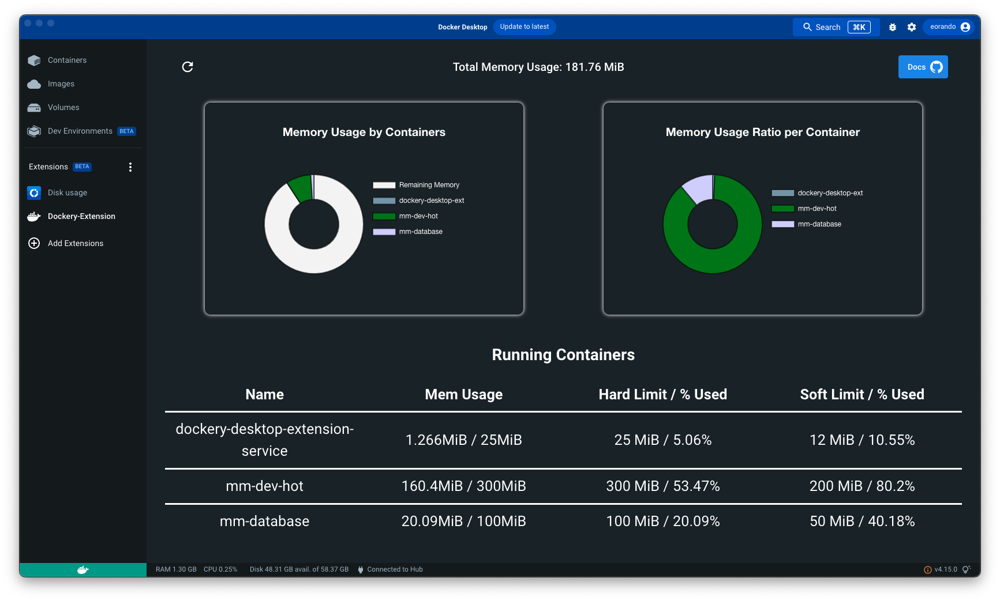

# Dockery

Dockery is a Docker Destop extension that simplifies monitoring and updating container memory limits. With an intuitive UI, users can both easily understand container memory usage and set or udpdate memory limits - both hard limit(--memory) and soft limit(--memory-reservation)

 
<h2>Features</h2>

  Dockery displays real-time, important memory metrics such as total memory used by all containers, memory usage by container, and memory usage ratio by container (fig 1). These metrics are displayed in easy to digest graphs. However, the real power of Dockery lies within its table, where detailed memory metrics on all running containers are shown. Clicking on a row reveals an intuitive GUI where users can do 2 things: 
  <ol>
    <li>Visually compare memory usage to the soft & hard limits (fig 2)</li>
    <li>Easily re-allocate memory through assignment of memory limits (fig 3)</li>
  </ol>

 

<h3 align="center">
  <em>Figure 1: Intuitive UI to understand memory metrics on all running containers</em>
</h3>

  

 

<h3 align="center">
  <em>Figure 2: Detailed memory metrics on all containers found within the table</em>
</h3>

  

 

<h3 align="center">
  <em>Figure 3: Intuitive UI for updating memory limits</em>
</h3>

  

 

<h2>Getting Started</h2>

Getting started with Dockery can be done in 3 simple steps

<ol>
  <li>Fork and clone this repository to your local machine</li>
  <li>Build your docker image:  <code>docker build -t dockery .</code></li>
  <li>Install Dockery onto Docker Desktop:  <code>docker extension install dockery</code> (if asked 'Are you sure you want to continue? [y/N]', enter 'y')</li>
</ol>

Next time you open Docker Desktop you should see Dockery installed and you can begin using it to manage your containers.

 
<h3>Extension Marketplace:</h3>

We are in the process of applying to have Dockery added to the Docker Desktop Extension Marketplace, but it is not yet avaliable there. 

 
<h3>Windows containers</h3>

Under the hood, Dockery uses the <code>docker update</code> command to update container memory limits, which is currently NOT supported for Windows containers. If you are running Windows containers, you can still use Dockery to visualy monitor your container memory metrics and limits, but to update you will still need to use the CLI and update limits another way.

 
<h2>Contributors</h2>

<ul>
  <li>Mike Battey  | <a href='https://www.linkedin.com/in/michael-battey-0591a1133/' target ='blank' >Linkedin</a> | <a href='https://github.com/Mrbattey' target = 'blank'>Github</a></li>
  <li>Benjamin Ly  | <a href='https://www.linkedin.com/in/benjaminly88/' target = 'blank'>Linkedin</a> | <a href = 'https://github.com/benjaminly88' target = 'blank'>Github</a></li>
  <li>Chase Mann | <a href = 'https://www.linkedin.com/in/chase-mann/' target = 'blank'>Linkedin</a> | <a href= 'https://github.com/xChesa' target = 'blank'>Github</a></li>
  <li>Eliot Orando | <a href = 'https://www.linkedin.com/in/eliot-orando/' target = 'blank'>Linkedin</a> | <a href = 'https://github.com/EliotOrando' target = 'blank'>Github</a></li>
</ul>
 
<h2>Proudly partnered with OS Labs</h2>

